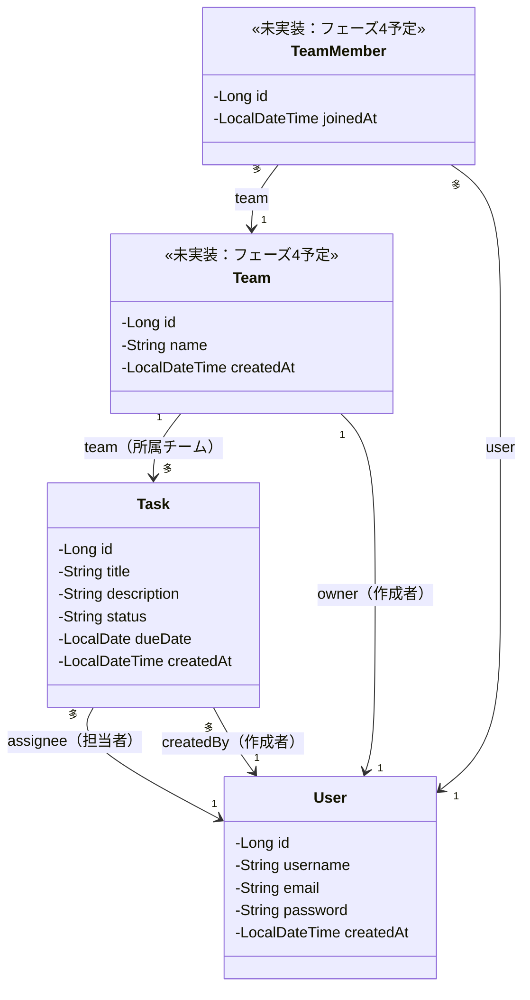

# TaskManagementApp 開発ログ

GitHubポートフォリオ用アプリ（タスク管理アプリ）の開発記録。

---

## 1. 要件定義

### アプリ概要
個人でのタスク管理に加え、チームを作成してタスクを共有できるWebアプリケーション。

### 目的
学習成果のアピール＋就活で使えるクオリティのポートフォリオ

### 機能一覧

**ユーザー機能**
- 会員登録（サインアップ）
- ログイン／ログアウト（Spring Security）
- ユーザープロフィール表示

**タスク機能**
- タスクの作成・編集・削除・一覧表示（CRUD）
- タスクのステータス管理（未着手／進行中／完了）
- タスクの担当者割り当て
- 期限日の設定

**チーム機能**
- チームの作成
- メンバーの招待
- チーム内タスクの共有・一覧表示

### 画面一覧

| 画面 | 概要 |
|---|---|
| ログイン画面 | ログインフォーム |
| 会員登録画面 | 新規ユーザー登録フォーム |
| タスク一覧画面 | 個人タスク／チームタスクの一覧表示 |
| タスク詳細・編集画面 | タスクの詳細確認・編集 |
| チーム一覧画面 | 所属チームの一覧表示 |
| チーム詳細画面 | チームメンバー・タスクの表示、メンバー招待 |

### データベース設計

**users（ユーザー）**
| カラム名 | 型 | 説明 |
|---|---|---|
| id | BIGINT (PK) | ユーザーID |
| username | VARCHAR | ユーザー名 |
| email | VARCHAR (UNIQUE) | メールアドレス |
| password | VARCHAR | パスワード（ハッシュ化） |
| created_at | TIMESTAMP | 作成日時 |

**teams（チーム）**
| カラム名 | 型 | 説明 |
|---|---|---|
| id | BIGINT (PK) | チームID |
| name | VARCHAR | チーム名 |
| owner_id | BIGINT (FK → users.id) | チーム作成者 |
| created_at | TIMESTAMP | 作成日時 |

**team_members（チームメンバー：中間テーブル）**
| カラム名 | 型 | 説明 |
|---|---|---|
| id | BIGINT (PK) | ID |
| team_id | BIGINT (FK → teams.id) | チームID |
| user_id | BIGINT (FK → users.id) | ユーザーID |
| joined_at | TIMESTAMP | 参加日時 |

**tasks（タスク）**
| カラム名 | 型 | 説明 |
|---|---|---|
| id | BIGINT (PK) | タスクID |
| title | VARCHAR | タスク名 |
| description | TEXT | 詳細 |
| status | VARCHAR | ステータス（未着手／進行中／完了） |
| due_date | DATE | 期限日 |
| team_id | BIGINT (FK → teams.id, NULL可) | 所属チーム（個人タスクの場合はNULL） |
| assignee_id | BIGINT (FK → users.id) | 担当者 |
| created_by | BIGINT (FK → users.id) | 作成者 |
| created_at | TIMESTAMP | 作成日時 |

### ER関連の概要
- `users` 1 - N `tasks`（作成者・担当者として）
- `users` N - N `teams`（`team_members` 中間テーブル経由）
- `teams` 1 - N `tasks`

### クラス図（現時点：フェーズ3-1完了時点）



**現時点で実装済みの関連**：
- `Task` → `User`（assignee）：多対1。1人のユーザーが、複数のタスクの担当者になれる
- `Task` → `User`（createdBy）：多対1。1人のユーザーが、複数のタスクを作成できる（`assignee`とは別役割の関連）

同じ`User`エンティティに対して、役割の異なる2本の関連（担当者・作成者）を持っている点がポイント。`Team`・`TeamMember`はフェーズ4で実装予定のため、現時点では未実装として図に含めている。

---

## 2. 開発環境・プロジェクト構成

### 技術スタック

| 項目 | 内容 |
|---|---|
| 言語 | Java 17（LTS） |
| フレームワーク | Spring Boot 4.1.0 |
| ビルドツール | Gradle |
| DB | PostgreSQL |
| ORM | Spring Data JPA |
| テンプレートエンジン | Thymeleaf |
| 認証 | Spring Security |
| テスト | JUnit 5, MockMvc |
| バージョン管理 | Git / GitHub |

### プロジェクト情報
- Group：`com.example`
- Artifact：`spring-task-management`

### パッケージ構成案

```
com.example.spring_task_management
├── SpringTaskManagementApplication.java   … エントリーポイント
├── config/                          … Spring Security等の設定クラス
├── controller/                      … Controller（画面・API）
│   ├── AuthController.java
│   ├── TaskController.java
│   └── TeamController.java
├── entity/                          … JPAエンティティ
│   ├── User.java
│   ├── Team.java
│   ├── TeamMember.java
│   └── Task.java
├── repository/                      … Spring Data JPAリポジトリ
│   ├── UserRepository.java
│   ├── TeamRepository.java
│   └── TaskRepository.java
├── service/                         … ビジネスロジック
│   ├── UserService.java
│   ├── TeamService.java
│   └── TaskService.java
└── dto/                             … 画面・API用の入出力データ
```

### 開発フェーズ計画

| フェーズ | 内容 | 状態 |
|---|---|---|
| フェーズ1 | プロジェクト作成、PostgreSQL接続確認 | ✅ 完了 |
| フェーズ2 | ユーザー機能（会員登録・ログイン・Spring Security設定） | ✅ 完了 |
| フェーズ3 | タスクのCRUD機能（個人タスクのみ） | 🔄 進行中 |
| フェーズ4 | チーム機能（作成・メンバー招待） | 未着手 |
| フェーズ5 | チームタスクの共有機能 | 未着手 |
| フェーズ6 | 仕上げ（バリデーション・エラーハンドリング・READMEなどのドキュメント整備） | 未着手 |
| （任意）フェーズ7 | REST API化・テストコード追加 | 未着手 |

---

## 3. DB接続情報の管理方針

機密情報（DB接続情報）をソースやGit管理対象から分離する方針を採用。

### 採用方式：ローカル設定ファイル（方法B）＋ プレースホルダー

**`application.properties`（共通・コミット対象）**
```properties
spring.profiles.active=local
```

**`application-local.properties`（ローカル専用・`.gitignore`で除外）**
```properties
spring.datasource.url=jdbc:postgresql://${DB_HOST:localhost}:${DB_PORT:5432}/${DB_NAME:task_management}
spring.datasource.username=${DB_USERNAME:postgres}
spring.datasource.password=${DB_PASSWORD}
spring.jpa.hibernate.ddl-auto=update
spring.jpa.show-sql=true
```

**`.gitignore` に追加**
```
### Local environment ###
application-local.properties
```

### 方針決定の理由
- `ddl-auto` のように環境ごとに値を変えるべき設定（ローカル：`update` ／ 本番：`validate`や`none`）も含め、環境依存の設定は `application-local.properties` 側にまとめる方針とした
- 実際の値は、IntelliJの実行構成（Run Configuration）の環境変数（`DB_USERNAME`、`DB_PASSWORD`など）から注入する
- 本番運用時は `SPRING_PROFILES_ACTIVE=prod` のように、起動時の環境変数でプロファイルを上書きする想定（ソースコードの書き換えは不要）

---

## 4. フェーズ1：プロジェクト作成・PostgreSQL接続確認

**実施内容**：
1. Spring Initializrでプロジェクト作成（Spring Boot 4.1.0、Java 17、Gradle）
2. PostgreSQLに `task_management` データベースを作成
3. `application.properties` / `application-local.properties` を上記方針で構成
4. IntelliJの実行構成に環境変数（`DB_USERNAME`、`DB_PASSWORD`）を設定
5. アプリケーションを起動

**実施結果**：✅ 完了
- アプリケーションが正常に起動（`Started SpringTaskManagementApplication`）
- PostgreSQLへの接続を確認
  - `Database JDBC URL [jdbc:postgresql://localhost:5432/task_management]`
  - `Database driver: PostgreSQL JDBC Driver`
  - `Database dialect: PostgreSQLDialect`
  - `Database version: 18.4`
  - HikariCPコネクションプールの起動を確認

---

## 5. フェーズ2：ユーザー機能（会員登録・ログイン・Spring Security設定）

サブステップに分割して実施。
- 2-1：Userエンティティ・Repository作成
- 2-2：Spring Security基本設定（パスワード暗号化、認証設定）
- 2-3：会員登録機能（サインアップ）
- 2-4：ログイン・ログアウト機能（画面含む）
- 2-5：ユーザープロフィール表示

### 5-1. フェーズ2-1：Userエンティティ・Repository作成

**実施内容**：
1. サンプル（`SampleItem` / `SampleItemRepository`）で `@Entity`・`@Table`・`@Id`・`@GeneratedValue`・`JpaRepository` の基本を確認
2. 要件定義に基づき `User` エンティティ・`UserRepository` を実装

**実装コード**：

`entity/User.java`
```java
package com.example.spring_task_management.entity;

import jakarta.persistence.*;
import java.time.LocalDateTime;

@Entity
@Table(name = "users")
public class User {

    @Id
    @GeneratedValue(strategy = GenerationType.IDENTITY)
    private Long id;
    private String username;
    @Column(unique = true)
    private String email;
    private String password;
    private LocalDateTime createdAt = LocalDateTime.now();

    // getter / setter 省略
}
```

`repository/UserRepository.java`
```java
package com.example.spring_task_management.repository;

import com.example.spring_task_management.entity.User;
import org.springframework.data.jpa.repository.JpaRepository;
import java.util.Optional;

public interface UserRepository extends JpaRepository<User, Long> {
    Optional<User> findByEmail(String email);
}
```

**つまずいた点・学び**：
- `@Table(name = "users")` を省略すると、クラス名から自動生成されるテーブル名が `user`（単数形）になる
- PostgreSQLでは `user` が予約語のため、`CREATE TABLE user (...)` が構文エラーになる
  → `@Table(name = "...")` で明示的にテーブル名を指定することの重要性を実感
- Spring Data JPAの「クエリメソッド機能」：`findByEmail` のようにメソッド名を規約に沿って書くだけで、実装なしにSQL相当の処理が自動生成される（`find + By + フィールド名` の命名規則を解析している）
- 戻り値を `Optional<User>` にする理由：該当ユーザーが存在しない可能性を型で表現し、`null` チェック漏れを防ぐため

**実施結果**：✅ 完了
- `users` テーブルが自動生成されることを確認（`\d users` で構造確認済み）
- `email` に `UNIQUE CONSTRAINT` が付与されていることを確認
- `id` は `bigint` / `generated by default as identity`（自動採番）で作成
- `findByEmail` メソッドを実装

---

### 5-2. フェーズ2-2：Spring Security基本設定（パスワード暗号化、認証設定）

**実施内容**：
1. `PasswordEncoder`（`BCryptPasswordEncoder`）をBean登録し、パスワードのハッシュ化を確認
2. `SecurityFilterChain` を実装し、学習用エンドポイントを `permitAll()` に設定

**実装コード**：

`config/SecurityConfig.java`
```java
package com.example.spring_task_management.config;

import org.springframework.context.annotation.Bean;
import org.springframework.context.annotation.Configuration;
import org.springframework.security.config.annotation.web.builders.HttpSecurity;
import org.springframework.security.crypto.bcrypt.BCryptPasswordEncoder;
import org.springframework.security.crypto.password.PasswordEncoder;
import org.springframework.security.web.SecurityFilterChain;

@Configuration
public class SecurityConfig {

    @Bean
    public PasswordEncoder passwordEncoder() {
        return new BCryptPasswordEncoder();
    }

    @Bean
    public SecurityFilterChain securityFilterChain(HttpSecurity http) throws Exception {
        http.authorizeHttpRequests(
                auth -> auth.requestMatchers(
                        "/hello",
                        "/greeting",
                        "/hello-param",
                        "/calc",
                        "/error",
                        "/encode-test"
                ).permitAll().anyRequest().authenticated()
        );
        return http.build();
    }
}
```

**つまずいた点・学び（トラブルシューティング）**：

1. **`/encode-test` にアクセスすると403エラー**
   - 原因調査のため `logging.level.org.springframework.security=DEBUG` でログを有効化
   - ログから、`/encode-test` 自体は `permitAll` により許可されているが、その後 `/error` へ内部転送され、そこが未許可のため403になっていることが判明
   - 学び：表面上の403は「見せかけ」であることがあり、内部転送先（`/error`）まで確認する必要がある

2. **`/error` を許可リストに追加して本来のエラーを確認**
   - `NoResourceFoundException: No static resource encode-test` というエラーが判明
   - 原因：`HelloController` クラスに **`@RestController` アノテーションが欠落**していた（import文の書き直し時に誤って削除された可能性）
   - `@RestController` を追加して解決
   - 学び：Controllerとして認識されないと、エンドポイント自体が「存在しないURL」として扱われ、Spring Securityの設定とは無関係にエラーになる。エラーの切り分けでは「Security側の問題か」「Controller側の問題か」を分けて考える必要がある

**Bean・DIについての補足理解**：
- `@Bean`：メソッドが返すオブジェクトをSpringコンテナに登録し、他クラスから `@Autowired` で利用可能にする仕組み
- Beanにする利点：使い回しがしやすい、実装の差し替えが容易、生成・破棄の管理をSpringに任せられる

**達成基準の修正**：
- 当初「起動時の生成パスワードログが消える」を達成基準としていたが誤り。これは独自の `UserDetailsService`（フェーズ2-4で実装予定）を登録するまでは表示されたままで正常な挙動

**実施結果**：✅ 完了
- `/encode-test?raw=password123` にログインなしでアクセスし、BCryptによるハッシュ化結果（`$2a$10$...` 形式）と `matches: true` を確認
- `permitAll()` / `authenticated()` によるアクセス制御が正しく機能していることを確認

---

### 5-3. フェーズ2-3：会員登録機能（サインアップ）

**実施内容**：
1. `UserService` を作成し、Controller・Service・Repositoryの役割分担を確認
2. パスワードをハッシュ化した上で `User` を保存する処理を実装
3. `findByEmail` を用いた重複登録チェック機能を追加

**実装コード**：

`service/UserService.java`
```java
package com.example.spring_task_management.service;

import com.example.spring_task_management.entity.User;
import com.example.spring_task_management.repository.UserRepository;
import org.springframework.beans.factory.annotation.Autowired;
import org.springframework.security.crypto.password.PasswordEncoder;
import org.springframework.stereotype.Service;

@Service
public class UserService {

    @Autowired
    private UserRepository userRepository;

    @Autowired
    private PasswordEncoder passwordEncoder;

    public User registerUser(String username, String email, String rawPassword) {
        // 重複登録チェック
        if (userRepository.findByEmail(email).isPresent()) {
            throw new IllegalStateException("このメールアドレスはすでに登録されています");
        }
        User user = new User();
        user.setUsername(username);
        user.setEmail(email);
        user.setPassword(passwordEncoder.encode(rawPassword)); // パスワードはハッシュ化して保存
        return userRepository.save(user);
    }
}
```

**確認した設計・役割分担**：
- Controller：リクエストの受け口（HTTPとのやりとり）
- Service（`@Service`）：業務ロジック（パスワードのハッシュ化、重複チェックなど）
- Repository：DBとのやりとり

**実施結果**：✅ 完了
- 新規登録：`taro@example.com` で登録し、DBに`password`がBCryptハッシュ形式（`$2a$10$...`）で保存されることを確認
- 重複登録防止：同一メールアドレスで再登録を試み、`IllegalStateException`（500エラー）が発生し、DBのレコードが増えないことを確認
- Hibernateが `findByEmail` を `SELECT ... WHERE email=?` のSQLに変換して実行する様子をログで確認

---

### 5-4. フェーズ2-4：ログイン・ログアウト機能（画面含む）

**実施内容**：
1. `CustomUserDetailsService`（`UserDetailsService`の実装）を作成し、DBの`User`情報を使った認証に対応
2. `SecurityConfig`に`formLogin`・`logout`の設定を追加
3. ログイン画面（`login.html`）、ログイン後の仮ホーム画面（`home.html`）を作成
4. `ViewController`で画面表示用のエンドポイントを追加

**実装コード**：

`service/CustomUserDetailsService.java`
```java
package com.example.spring_task_management.service;

import com.example.spring_task_management.entity.User;
import com.example.spring_task_management.repository.UserRepository;
import org.springframework.beans.factory.annotation.Autowired;
import org.springframework.security.core.userdetails.*;
import org.springframework.stereotype.Service;

@Service
public class CustomUserDetailsService implements UserDetailsService {

    @Autowired
    private UserRepository userRepository;

    /**
     * メールアドレスをもとに、DBからユーザー情報を取得しSpring Securityへ渡す
     * （パスワード照合はSpring Security側が自動で行う）
     * @param email the username identifying the user whose data is required.
     * @return 認証に必要な情報を持つUserDetailsオブジェクト
     * @throws UsernameNotFoundException 該当するユーザーが見つからない場合にスローされる
     */
    @Override
    public UserDetails loadUserByUsername(String email) throws UsernameNotFoundException {
        // 指定したメールアドレスに合致したUserを検索して取得、空（該当なし）だったら例外をスローする
        User user = userRepository.findByEmail(email).orElseThrow(
                () -> new UsernameNotFoundException("ユーザーが見つかりません: " + email));

        // 取得したUserエンティティを、戻り値のUserDetails型に整形（Spring Securityが用意しているUserクラスを利用）
        return org.springframework.security.core.userdetails.User           // Userエンティティとの名前衝突回避のためパッケージ名を付加
                .withUsername(user.getEmail())              // emailを実質的なログインIDとして扱っているため
                .password(user.getPassword())
                .authorities("USER")                        // ユーザ権限=USER
                .build();                                   // UserDetailsオブジェクトに整形して返す
    }
}
```

`config/SecurityConfig.java`（更新）
```java
@Bean
public SecurityFilterChain securityFilterChain(HttpSecurity http) throws Exception {
    http.authorizeHttpRequests(
            auth -> auth.requestMatchers(
                    "/hello", "/greeting", "/hello-param", "/calc",
                    "/error", "/encode-test", "/register-test",
                    "/login"
            ).permitAll().anyRequest().authenticated()
    )
    .formLogin(form -> form
            .loginPage("/login")
            .defaultSuccessUrl("/home", true)
            .permitAll()
    )
    .logout(logout -> logout
            .logoutSuccessUrl("/login?logout")
            .permitAll()
    );
    return http.build();
}
```

`controller/ViewController.java`
```java
@Controller
public class ViewController {

    @GetMapping("/login")
    public String loginPage() {
        return "login";
    }

    @GetMapping("/home")
    public String homePage() {
        return "home";
    }
}
```

**つまずいた点・学び（トラブルシューティング）**：

1. **`ViewController` に `@Controller` を付け忘れ、`/login` にアクセスすると404エラー**
   - `HelloController`で`@RestController`を忘れた時と同じ原理（クラスに`@Controller`系のアノテーションがないと、中の`@GetMapping`が一切機能しない）
   - `@Controller`と`@RestController`の違い：`@Controller`は戻り値を「表示するテンプレート名」として解釈、`@RestController`は戻り値をそのまま返す

2. **ログイン成功後 `/hello` へ遷移する設定だったが、`HelloController`から`/hello`メソッド自体が無くなっており404エラー**
   - `NoResourceFoundException: No static resource hello` が発生
   - 対応：ログイン後の遷移先を仮のホーム画面（`/home`）に変更する方針とした（学習用エンドポイントに依存しない設計に修正）

**概念理解の補足**：
- `Optional`の`orElseThrow`：値があれば取り出し、なければ指定した例外を投げる（`Optional`クラス内部にすでに判定ロジックが実装されており、呼び出し側は「空だった場合の処理」だけを渡す）
- ラムダ式（`() -> ...`、`auth -> ...`、`form -> ...`）：その場で作る名前のない小さな処理のかたまり。Spring Securityの設定コードでは「〇〇 -> 〇〇.設定().設定()...」という統一されたスタイルで多用される
- 認証（Authentication）と認可（Authorization）の違い：認証は「本人確認」、認可は「権限確認」。`SecurityFilterChain`はこの両方を定義するルールブックにあたる
- `formLogin`/`logout`内の`.permitAll()`：ログイン・ログアウト自体の入り口となるURLを、未認証でもアクセス可能にする設定（これがないとログイン画面自体に到達できず矛盾が生じる）
- `defaultSuccessUrl(url, true)`の第2引数：`true`で常に指定URLへ遷移、`false`（デフォルト）だと元々アクセスしようとしていた保護ページへ遷移

**実施結果**：✅ 完了
- ログイン：`taro@example.com`でログインし、`/home`（ログイン成功画面）へ遷移することを確認
- ログアウト：ログアウトボタン押下後、`/login?logout`へ遷移し、ログイン画面が再表示されることを確認
- Hibernateのログにより、ログイン時に`CustomUserDetailsService`経由で`findByEmail`のSQLが発行されていることを確認
- 異常系：存在しないメールアドレス（`test@example.com`）でログインを試行し、`/login?error`へリダイレクトされることを確認（`CustomUserDetailsService`内の`UsernameNotFoundException`をSpring Securityが正しく認証失敗として処理）

---

### 5-5. フェーズ2-5：ユーザープロフィール表示

**実施内容**：
1. ログイン中のユーザー情報を取得し、画面に表示する機能を実装
2. `@AuthenticationPrincipal` を用いて、現在ログイン中の `UserDetails` を取得
3. `Model` を介してThymeleafへ値を渡し、プロフィール画面に表示

**実装コード**：

`controller/ViewController.java`（追加分）
```java
import org.springframework.security.core.annotation.AuthenticationPrincipal;
import org.springframework.security.core.userdetails.UserDetails;
import org.springframework.ui.Model;

@GetMapping("/profile")
public String profilePage(@AuthenticationPrincipal UserDetails userDetails, Model model) {
    model.addAttribute("email", userDetails.getUsername());
    return "profile";
}
```

`resources/templates/profile.html`
```html
<!DOCTYPE html>
<html xmlns:th="http://www.thymeleaf.org">
<head>
    <meta charset="UTF-8">
    <title>プロフィール</title>
</head>
<body>
    <h1>プロフィール</h1>
    <p>ログイン中のメールアドレス: <span th:text="${email}"></span></p>
    <a th:href="@{/home}">ホームに戻る</a>
</body>
</html>
```

**概念理解の補足（質疑応答より）**：
- `@{...}`（Thymeleafのリンク URL式）：単なる文字列連結ではなく、アプリのコンテキストパスを自動補完してURLを組み立てる機能。将来的にサーバーのデプロイ先URLが変わっても、`th:href="@{/xxx}"`の書き方をしていれば自動的に正しいリンクになる
- `@AuthenticationPrincipal`：「現在ログイン中のユーザー情報を、このメソッドの引数に自動的に入れてください」とSpring Securityに指示するアノテーション。フェーズ2-4で`CustomUserDetailsService`が組み立てた`UserDetails`が、ここに渡ってくる
- `Model`：ControllerからHTML（View）へデータを橋渡しする入れ物。`model.addAttribute("キー", 値)`で登録した値を、HTML側で`${キー}`として参照できる
- `@GetMapping("/profile")`の**URLパス**と、`return "profile";`の**戻り値（テンプレート名）**は名前が似ているが別物：前者は「アクセスされた時の入り口の条件（URL）」、後者は「表示するHTMLファイルの指定（View名）」。たまたま名称が似ているだけで、本来は無関係に決められるもの

**実施結果**：✅ 完了
- ログイン中のメールアドレス（`taro@example.com`）が `/profile` 画面に正しく表示されることを確認
- ホーム画面からプロフィール画面への行き来、ログアウトまで一連の流れが問題なく動作

---

### 5-6. フェーズ2完了に伴う整理：学習用エンドポイントの削除

フェーズ2（ユーザー機能一式）の完了に伴い、動作確認用に残していた `HelloController`（`/hello`、`/greeting`、`/hello-param`、`/calc`、`/encode-test`、`/register-test`）を削除。

**実施内容**：
1. `controller/HelloController.java` を削除
2. `SecurityConfig` の `requestMatchers` から、`HelloController`関連の許可パスを削除し、`/error`・`/login`のみに整理

**整理後のコード**：

`config/SecurityConfig.java`（最終形）
```java
package com.example.spring_task_management.config;

import org.springframework.context.annotation.Bean;
import org.springframework.context.annotation.Configuration;
import org.springframework.security.config.annotation.web.builders.HttpSecurity;
import org.springframework.security.crypto.bcrypt.BCryptPasswordEncoder;
import org.springframework.security.crypto.password.PasswordEncoder;
import org.springframework.security.web.SecurityFilterChain;

@Configuration
public class SecurityConfig {

    /**
     * パスワードを安全にハッシュ化する仕組み
     * @return BCryptPasswordEncoder のインスタンス→Springコンテナに登録される
     */
    @Bean
    public PasswordEncoder passwordEncoder() {
        return new BCryptPasswordEncoder();
    }

    /**
     * 認証、認可のルール定義
     * @param http
     * @return 実際のセキュリティフィルターの鎖（SecurityFilterChain）を生成し戻り値とする
     * @throws Exception
     */
    @Bean
    public SecurityFilterChain securityFilterChain(HttpSecurity http) throws Exception {

        /*
            .authorizeHttpRequests
            ここで指定したエンドポイントは認証不要とする

            .formLogin
            フォームログイン機能の設定
                .loginPage("/login")                    // ログインURLを定義
                .defaultSuccessUrl("/home", true)      // ログイン成功したら必ず「～/home」に遷移
                .permitAll()                            // このURLは認証不要

            .logout
            ログアウト機能の設定
                .logoutSuccessUrl("/login?logout")      // ログアウト成功したらこのURLへ遷移（クエリパラメータlogoutを付加）
                .permitAll()                            // このURLは認証不要
         */
        http
                .authorizeHttpRequests(
                    auth -> auth.requestMatchers(
                            "/error",
                            "/login"
                    ).permitAll().anyRequest().authenticated()
                )
                .formLogin(
                    form -> form
                        .loginPage("/login")
                        .defaultSuccessUrl("/home", true)
                        .permitAll()
                )
                .logout(logout -> logout
                    .logoutSuccessUrl("/login?logout")
                    .permitAll()
                )
        ;
        return http.build();
    }
}
```

**実施結果**：✅ 完了
- `HelloController` 削除後もコンパイルエラーなく起動することを確認
- ログイン → `/home` → `/profile` → ログアウトの一連の流れが引き続き正常に動作することを確認

---

### 5-7. フェーズ2追加対応：会員登録画面

**背景**：フェーズ3-2（タスク作成機能）の動作確認用テストユーザーを作成する必要が生じたが、`HelloController`（動作確認用の`/register-test`）はすでに削除済み。これを機に、要件定義で予定していた正式な会員登録画面を実装することとした。

**実施内容**：
1. 会員登録画面（`register.html`）を作成
2. `ViewController`に画面表示用（GET）とフォーム送信受付用（POST）のエンドポイントを追加
3. 既存の`UserService.registerUser`（ハッシュ化・重複チェック機能）をそのまま再利用
4. `SecurityConfig`の許可リストに`/register`を追加

**実装コード**：

`resources/templates/register.html`
```html
<!DOCTYPE html>
<html xmlns:th="http://www.thymeleaf.org">
<head>
    <meta charset="UTF-8">
    <title>会員登録</title>
</head>
<body>
    <h1>会員登録</h1>
    <form th:action="@{/register}" method="post">
        <div>
            <label>ユーザー名: <input type="text" name="username" /></label>
        </div>
        <div>
            <label>メールアドレス: <input type="text" name="email" /></label>
        </div>
        <div>
            <label>パスワード: <input type="password" name="password" /></label>
        </div>
        <button type="submit">登録する</button>
    </form>
</body>
</html>
```

`controller/ViewController.java`（追加分）
```java
@GetMapping("/register")
public String registerPage() {
    return "register";
}

@Autowired
private UserService userService;

@PostMapping("/register")
public String register(@RequestParam String username,
                        @RequestParam String email,
                        @RequestParam String password) {
    userService.registerUser(username, email, password);
    return "redirect:/login";
}
```

**概念理解の補足**：
- `@PostMapping`：`@GetMapping`とは異なり、フォーム送信（HTTPのPOSTメソッド）を受け取るためのアノテーション。`<form method="post">`と対になる
- `return "redirect:/login";`：戻り値の先頭に`redirect:`を付けることで、指定URLへブラウザ側でリダイレクトさせる特別な指示になる（通常の`return "login";`とは異なり、テンプレート名としてではなくリダイレクト指示として解釈される）

**実施結果**：✅ 完了
- `/register`から`test@example.com`で新規登録し、`/login`へ正しくリダイレクトされることを確認
- 登録した情報でログインでき、`/home`→`/profile`まで一連の流れが正常動作することを確認
- DBの`password`カラムがBCryptハッシュ形式（`$2a$10$...`）で保存されていることを確認（平文保存でないことを確認）

---

## 6. フェーズ2 総括

フェーズ2（ユーザー機能：会員登録・ログイン・Spring Security設定）が全サブステップ完了。

**質疑応答を通じて整理した主要概念**：

| 概念 | 要点 |
|---|---|
| `Optional` / `isPresent()` / `orElseThrow()` | 値の有無を型で表現し、`null`チェック漏れを防ぐ。`orElseThrow`は「あれば取り出す、なければ例外を投げる」を1行で表現する仕組み。条件分岐自体は`Optional`クラス内部にすでに実装されており、呼び出し側は「空だった場合の処理」だけを渡している |
| ラムダ式（`() -> ...`など） | その場で作る名前のない小さな処理のかたまり。Spring Securityの設定コード全体で「〇〇 -> 〇〇.設定().設定()...」という統一されたスタイルで多用される |
| `@Bean` / DI | メソッドが返すオブジェクトをSpringコンテナに登録し、`@Autowired`で他クラスから利用可能にする仕組み。使い回し・差し替えが容易になり、生成・破棄の管理をSpringに任せられる |
| `@Controller` と `@RestController` | `@Controller`は戻り値を「表示するテンプレート名」として解釈（画面表示用）、`@RestController`は戻り値をそのままレスポンスとして返す（API用）。いずれもクラスにアノテーションが無いと中の`@GetMapping`は一切機能しない |
| 認証（Authentication）と認可（Authorization） | 認証は「本人確認」、認可は「権限確認」。`SecurityFilterChain`はこの両方を定義するルールブック |
| `SecurityFilterChain` | リクエストが通過する「フィルターの連鎖」の組み立て方（どのURLを自由に通すか、ログイン画面はどこか等）を定義するBean |
| `@AuthenticationPrincipal` | 現在ログイン中のユーザー情報（`UserDetails`）を、メソッドの引数として直接受け取れるアノテーション |
| Thymeleafの`@{...}` | URLを組み立てる構文。コンテキストパスを自動補完し、デプロイ環境が変わってもリンクが壊れないようにする |

**トラブルシューティングを通じて得た教訓**：
- 表面上のエラー（403など）が「見せかけ」であることがあり、内部転送先（`/error`）まで確認する必要がある
- Controller・RestControllerのアノテーション漏れは、エンドポイント自体が「存在しないURL」として扱われるため、Spring Security側の問題と混同しないよう切り分けが重要
- URLパス（`@GetMapping`の引数）とテンプレート名（`return`の戻り値）は名前が似ていても本来無関係なもの

---

## 7. フェーズ3：タスクのCRUD機能（個人タスクのみ）

サブステップに分割して実施。
- 3-1：Taskエンティティ・Repository作成
- 3-2：タスク作成機能（登録）
- 3-3：タスク一覧表示機能
- 3-4：タスク詳細・編集機能
- 3-5：タスク削除機能
- 3-6：ステータス管理（未着手／進行中／完了）の組み込み

### 7-1. フェーズ3-1：Taskエンティティ・Repository作成

**実施内容**：
1. サンプル（`SampleNote`）で `@ManyToOne`・`@JoinColumn` による他エンティティとの関連（外部キー）の書き方を確認
2. 要件定義に基づき `Task` エンティティ・`TaskRepository` を実装（`assignee`・`createdBy`の2つの`User`関連を持つ）

**実装コード**：

`entity/Task.java`
```java
package com.example.spring_task_management.entity;

import jakarta.persistence.*;

import java.time.LocalDate;
import java.time.LocalDateTime;

@Entity
@Table(name = "tasks")
public class Task {

    @Id
    @GeneratedValue(strategy = GenerationType.IDENTITY)
    private Long id;

    private String title;

    private String description;

    private String status;

    private LocalDate dueDate;

    @ManyToOne                              // Task:User=n:1
    @JoinColumn(name = "assignee_id")       // foreign key
    private User assignee;                  // 担当者

    @ManyToOne                              // Task:User=n:1
    @JoinColumn(name = "created_by")        // foreign key
    private User createdBy;

    private LocalDateTime createdAt = LocalDateTime.now();

    // getter / setter 省略
}
```

`repository/TaskRepository.java`
```java
package com.example.spring_task_management.repository;

import com.example.spring_task_management.entity.Task;
import org.springframework.data.jpa.repository.JpaRepository;

public interface TaskRepository extends JpaRepository<Task, Long> {
}
```

**概念理解の補足（質疑応答より）**：
- `@ManyToOne`：「多対1」の関連を表す。「複数の`Task`が、1人の`User`（担当者・作成者）に属する」という関係を表現
- `@JoinColumn(name = "...")`：外部キーとして実際にDBに作られるカラム名を明示的に指定するアノテーション
- フィールドの型を`Long`（IDそのもの）ではなく`User`（関連エンティティそのもの）にする理由：`task.getAssignee().getUsername()`のように、関連する相手の情報に直接アクセスできる。実際のDB保存時は、Hibernateが自動的にIDへ変換してくれる
- `JpaRepository<Task, Long>`のジェネリクス：1つ目は「扱うエンティティの型」、2つ目は「そのエンティティの主キーの型」。この情報をもとに、Spring Data JPAが適切な型のCRUDメソッドを自動生成する
- CRUD：Create（作成）・Read（読み取り）・Update（更新）・Delete（削除）の頭文字。`save()`は新規作成・更新の両方を兼ねる（IDの有無で内部的に判定される）

**実施結果**：✅ 完了
- `tasks`テーブルが自動生成されることを確認（`\d tasks`で構造確認済み）
- `assignee_id`・`created_by`の2つの外部キー制約が、それぞれ`users(id)`を正しく参照していることを確認
- `due_date`が`date`型で生成されていることを確認

---

